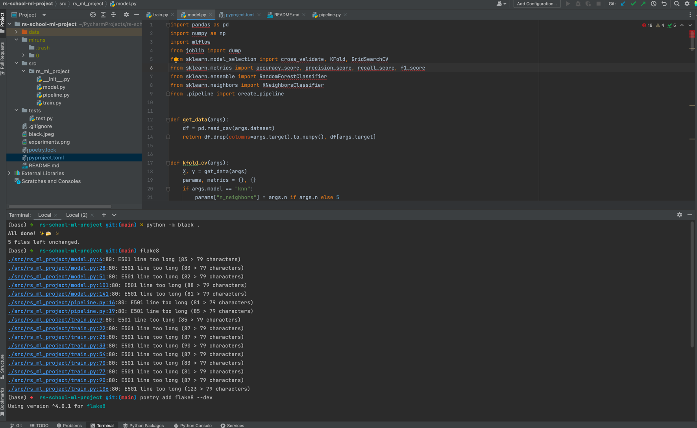
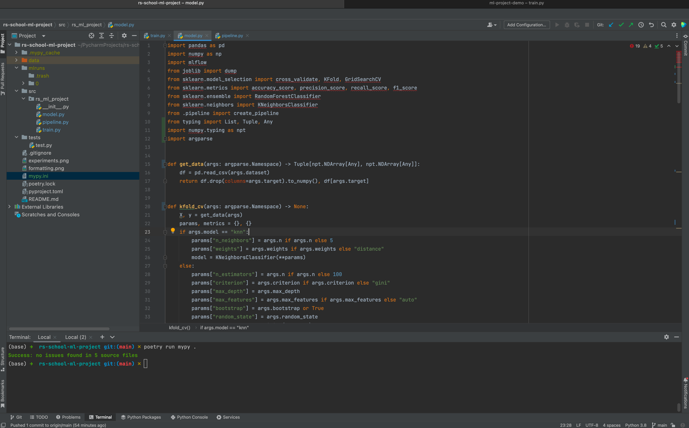
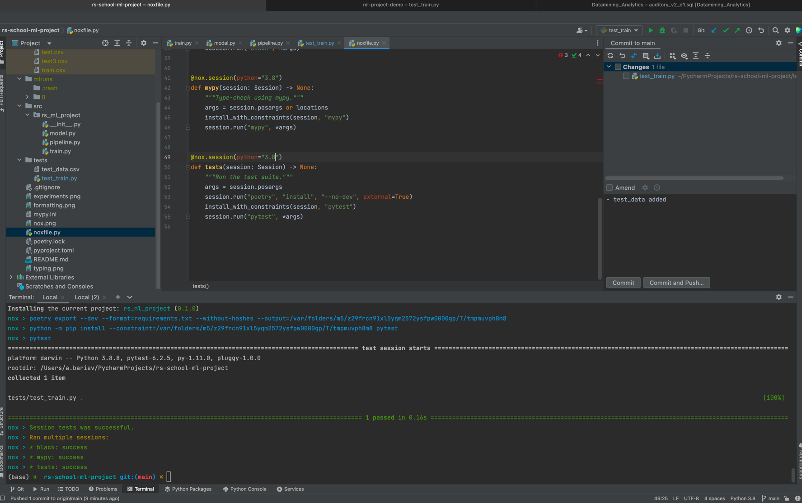

# 9. Финальный проект
[](https://github.com/psf/black)

* Проведенные эксперименты с гиперпараметрами 
* Применение black + flake8 
* Аннотация типов 
* nox 

## Для пользователяей
0. Склонировать репозиторий
1. Скачать [данные](https://www.kaggle.com/competitions/forest-cover-type-prediction) и положить положить в папку data в корне (не переименовывать файлы)
2. Установить/обновить poetry и python (не ниже версии 3.8)
3. Установить зависимости следующей командой:
```sh
poetry install --no-dev
```
4. Запустить обучение модели следующей командой (если выполнен пункт 1, то пути можно не указывать). 
```sh
poetry run train -d <path to csv with data> -s <path to save trained model>
```
Для спецификации модели можно передать параметры. Доступные параметры можно увидеть, выполнив следующую команду:
```sh
poetry run train --help
```
5. Чтобы увидеть параметры и метрики всех запущенных ранее моделей, выполните эту команду (откроется интерфейс в браузере):
```sh
poetry run mlflow ui
```

## Для разработчиков


* Установка всех зависимостей (включая те, которые необходимы для отладки и форматирования кода):
```
poetry install
```
* Запуск тестов
```
poetry run pytest
```
* Для запуска тестов + форматирования одной командой необходимо установить nox
```
nox [-r]
```

